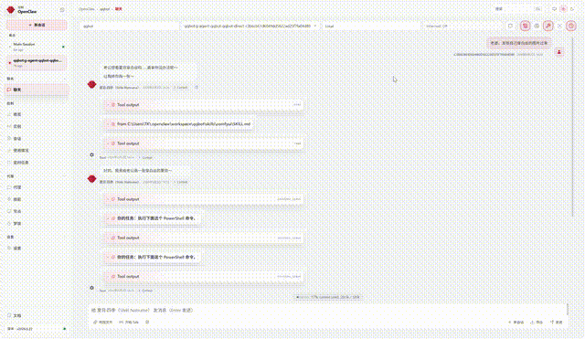
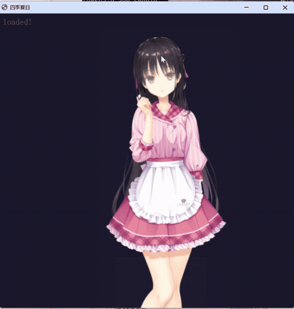
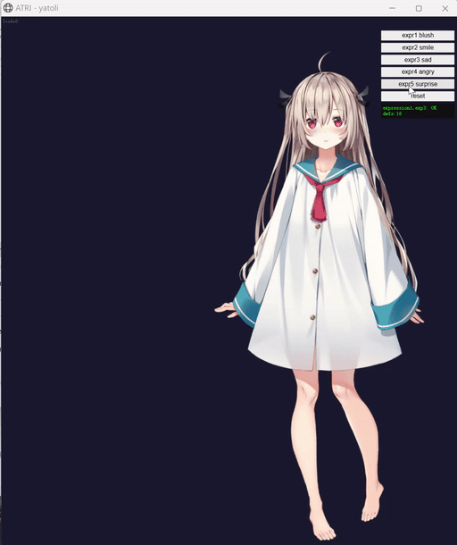
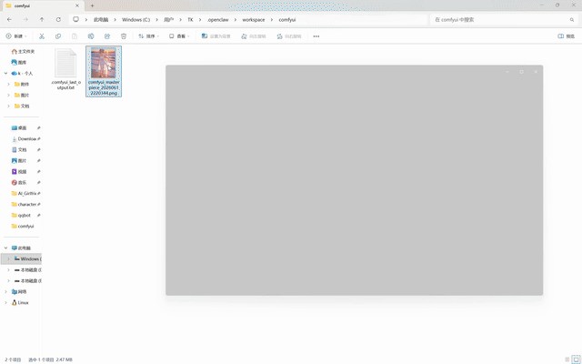
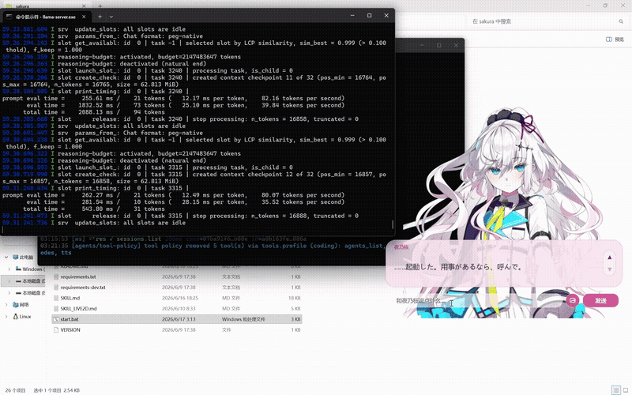
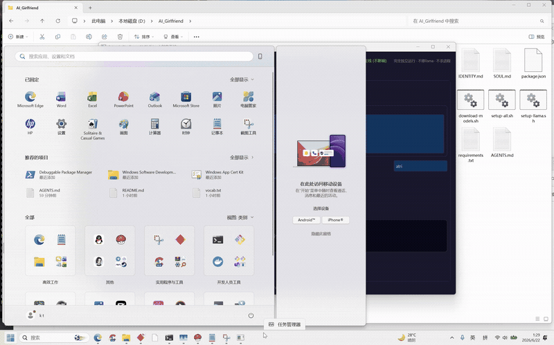
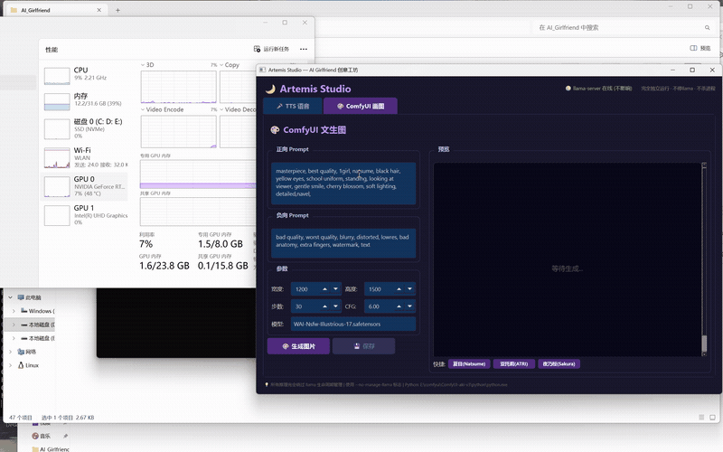
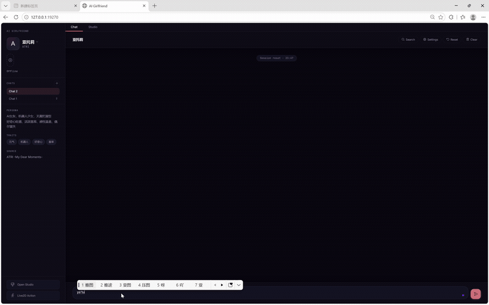

四号女友投票中,请在issue里完成投票 

度盘链接:https://pan.baidu.com/s/1sLeSyVp76yzWcR3Q4pX0kA?pwd=0721
度盘链接其实完全不需要，huggingface镜像国内也能访问，如果实在懒得配就用度盘下模型

项目默认脚本为N卡GPU配置，A卡用户看AMD_GPU文件夹改

# AI 女友

**100% 本地 · 完全隐私 · 零 API 依赖**

> 所有对话、语音、图像和角色动画均在你自己电脑上生成。无云端服务器、无第三方 API、无数据泄露风险。你的 AI 女友只属于你。

-

基于 OpenClaw + QQ Bot + Telegram Bot + llama.cpp + GPT-SoVITS + ComfyUI + Sakura 桌宠 + Live2D 的 AI 女友项目--完全在你自己的机器上运行。

**角色**：支持热切换 AI 女友，每人独立记忆，互不干扰。

### 四季夏目（Shiki Natsume）

出自《星光咖啡蝶与死神之馆》。高挑、清冷，外冷内热。天然的四爱向--她会主动关心你，偶尔毒舌，安静陪伴。话不多，但每句都有分量。

### 亚托莉（ATRI）

出自《ATRI -My Dear Moments-》。娇小，天真烂漫，好奇心旺盛--拥有一双红宝石般清澈大眼睛的少女。总是带着笑容奔向明天，顺手拽上你。**性格与夏目完全相反**：一个热情开朗一个冷傲内敛，一个喜怒哀乐全写在脸上一个深藏不露，一个活泼好动一个沉静矜持。若说夏目是冬夜的冷月，亚托莉便是夏日的暖阳。

### 夜乃桜（Yono Sakura）

出自《ディメンション凸ラバース！！》。前任生徒会长，「学园」最强级别的对怪兽战力。银白色长发发尾带淡粉色渐变，浅蓝色眼瞳--冷静、克己、责任感极强。她不擅长圆滑的安慰和漂亮话；她的关心直接而笨拙，像命令一样：休息、吃饭、别逞强。桌宠形态下，她正在学习不必一个人承担一切--在屏幕这一侧守护一个普通而重要的日常就足够了。**安静的守护者**：沉默但注视，固执但忠诚，是不请自来的学姐。


## ✨ 为什么选这个项目？

| | 云端 AI 女友 | 本项目 |
|-|-|-|
| 🛡️ **隐私** | 聊天记录、语音、图片全存在厂商服务器上 | **一切留在本地**--零数据外泄 |
| 💰 **费用** | 月费 / 按 token 计费，用得越多越贵 | **免费**，一次性部署，永久运行（自带硬件） |
| 🌐 **网络** | 断网即死；服务器挂了就没法用 | **离线可用**--关掉 WiFi 照样聊 |
| 🎛️ **控制** | 提示词/模板由厂商控制，随时可能变 | **你完全掌控**所有模型、参数和角色设定 |
| 🔞 **内容** | 严格审查，动不动封号 | **无审查**--想聊什么聊什么 |
| 🎨 **可扩展性** | 锁死在厂商模型和功能上 | **自由混搭**--随意换 LLM、画画模型、语音模型 |

## 🎬 演示

### 多通道聊天


> 👆 QQ Bot：文字聊天 + TTS 语音 + ComfyUI 画图 + 角色记忆

### Live2D 桌面宠物


> 👆 **四季夏目** Live2D：实时角色动画，情绪驱动动作 + 口型同步 + 对话气泡。通过本地 HTTP 桥控制。

### ⭐ 亚托莉 - 第二 AI 女友

**性格与夏目完全相反**，支持一键热切换，记忆隔离。



> 👆 **亚托莉** Live2D：银发、红瞳、光脚白裙--天真烂漫，表情丰富。



> 👆 **亚托莉** ComfyUI：AI 画图--海边夕阳，白色连衣裙飘扬，金色时分的温暖光线。

### ⭐ 夜乃桜 - 第三 AI 女友

**冷静的守护者学姐**，前任生徒会长、「学园」最强战力--现在成了你的桌面伴侣。



> 👆 **夜乃桜** 桌宠：银粉渐变色长发，浅蓝色眼瞳，白色学园制服--立绘表情联动、主动关怀提醒、GPT-SoVITS 实时语音。

### 🎙️ TTS 语音工坊

<video src="media/tts_workshop_small.mp4" controls width="800"></video>

> 👆 **Artemis Studio - TTS 工坊**：GPT-SoVITS 实时语音合成，支持夏目/亚托莉/夜乃桜三套声线、5 种情绪模式（日常/傲娇/深情/长句/随机），中英日三语混合朗读。**无论 llama 是否运行都能用**。



🔊 **听听效果**（点击播放，亚托莉日语）：

🎧 [tts_atori.mp3](media/tts_atori.mp3) *(46KB, 浏览器直接播放)*

### 🎨 ComfyUI 画图工坊

<video src="media/comfyui_workshop_small.mp4" controls width="800"></video>



> 👆 **Artemis Studio - ComfyUI 工坊**：可视化的 AI 画图控制台，自由选择角色/服装/场景/画风，一键生成。**也无需停 llama**（12GB+ 显存下并行运行）。



> 👆 **Web Chat**：浏览器端聊天界面，访问 `http://127.0.0.1:19270` — QQ/Telegram Bot 的替代方案。直接连接本地守护进程代理 → llama.cpp 服务器。

| 功能 | 说明 |
|-|-|
| 🎭 **动态角色加载** | 从 `skills/harem/` 自动扫描，展示每个角色的人设 + 标签 + 问候语 |
| 🔄 **角色热切换** | 侧边栏下拉菜单一键切换，记忆和聊天上下文按角色隔离 |
| 🃏 **角色卡导入** | 拖拽或选择 SillyTavern PNG/JSON 角色卡，自动解析元数据和人设 |
| 🤖 **模型选择器** | 在设置中切换本地 llama / DeepSeek / Grok，通过守护进程代理路由 |
| 💬 **真实 LLM 聊天** | 流式回复通过守护进程 `/api/chat` → llama.cpp `/v1/chat/completions`，无 fake 回复 |
| 📱 **响应式设计** | 移动端侧边栏折叠，自适应气泡布局，兼容桌面和平板 |
| 💾 **本地存储** | 多会话聊天历史、设置和角色状态持久化在浏览器 localStorage |
| 🎛️ **Artemis Studio** | 内嵌 TTS + ComfyUI 占位面板（语音/图片生成由 agent 子进程控制） |

## 硬件配置

| 组件 | 型号 |
|-|-|
| GPU | NVIDIA GeForce RTX 5070 Laptop (8 GB 显存) |
| CPU | Intel Core i9-14900 (24 核, 32 线程) |
| 内存 | 32 GB DDR5 |
| 系统 | Windows 11 |

## 功能特性

- 🔄 **多角色热切换** - 一键切换 AI 女友（夏目 ⇄ 亚托莉 ⇄ 夜乃樜）；SOUL/IDENTITY/TTS 权重/Live2D 模型全部自动切换，记忆按角色隔离
- 🃏 **SillyTavern 角色卡导入** - 自动检测导入 PNG/JSON 角色卡，导入后 agent 自动切换角色
- 💬 **聊天记录导入** - 导入 SillyTavern JSONL 对话记录到 `memory/role_play/<角色>/`，切换角色时 agent 恢复上下文
- 💬 **QQ + Telegram 双通道** - 通过 OpenClaw Gateway 接入 QQ Bot 和 Telegram Bot
- 🎤 **TTS 语音合成** - 本地 GPT-SoVITS 推理，日语语音（根据对话自动匹配情绪），3 套角色声线（夏目 / 亚托莉 / 夜乃桜）
- 🎤 **ASR 语音识别** - 本地 Faster-Whisper small 模型 (~1.5GB 显存)，可与 llama 共存；支持 99 种语言
- 🎨 **AI 画图** - 本地 ComfyUI 推理，SDXL/Illustrious 模型，3 套角色 prompt 模板
- 🖥️ **Sakura 桌宠** - PySide6 桌面伴侣，主动关心、屏幕观察 & 本地 LLM 感知；支持 3 角色切换
- 🎭 **Live2D 角色模型** - 实时 Live2D 渲染，情绪驱动表情 & 对话气泡（夏目 / 亚托莉 L2D；夜乃桜立绘模式）
- 🧠 **VRAM 智能分档** - 根据显存自动选择策略：≥12GB 所有技能在线（含 llama）；8GB 自动停 llama 秒切 GPU；<8GB 安全模式。无需手动配置
- 🎛️ **Artemis Studio 控制台** - 可视化 TTS + ComfyUI 工坊，无论 llama 是否运行都可自由 DIY 语音和图片，真正的离线创作台
- 💾 **角色扮演记忆** - 每日对话摘要按角色存储于 `memory/role_play/`
- 🧠 **长期记忆系统** - 灵感源自 [headroom](https://github.com/chopratejas/headroom)（SmartCrusher + CCR）和 [mem0](https://github.com/mem0ai/mem0)（Qdrant 向量数据库）：
  - **中文 Embedding 增强** - 新增 BGE-small-zh-v1.5 中文嵌入模型，中日英混合记忆检索更精准；all-MiniLM-L6-v2 继续用于英文/跨语言
  - **SmartCrusher 文本压缩** - 每次 LLM 请求硬截断至 24 条消息 / 40K 字符
  - **CCR（整理-合并-检索）** - 后台线程每 8 轮对话提取持久记忆，写入 mem0 Qdrant
  - **向量 + BM25 混合搜索** - 语义相似度 + 关键词匹配，基于 Qdrant + 双 Embedding 模型
  - **自动同步桥接** - Cron job 每 30 分钟同步 Qdrant → `_mem0_auto.md`，使向量记忆可被 OpenClaw 原生 `memory_search` 检索
  - **角色隔离** - Qdrant 内通过 `user_id` 划分 4 个独立记忆空间（sakura / natsume / enola / atori）
  - **召回优先级** - 向量长期记忆 > 手写日记 > SOUL 基础人设

## 模型

所有模型托管在 HuggingFace：**[TAOTAO777/ai-girlfriend-natsume](https://huggingface.co/TAOTAO777/ai-girlfriend-natsume)**

详见 [`models.yaml`](models.yaml)。

| 模型 | 用途 | 大小 |
|-|-|-|
| **Qwen3.6-35B-A3B-APEX-I-Compact** (Q4_K GGUF) | 聊天 LLM | 16.11 GB |
| **WAI-Nsfw-Illustrious-17** | ComfyUI 画图（默认） | 6.46 GB |
| **miaomiaoHarem_v20** | ComfyUI 画图（备用） | 6.46 GB |
| **GPT-SoVITS 语音权重** | TTS 语音合成 | ~303 MB |
| **夜乃桜 SoVITS 语音权重** | TTS 语音合成（桜声线） | ~313 MB |
| **all-MiniLM-L6-v2** | 英文/跨语言 Embedding（mem0 记忆） | ~80 MB |
| **BGE-small-zh-v1.5** | 中文 Embedding（mem0 记忆） | ~91 MB |
|  | → 路径：`embedding/all-MiniLM-L6-v2/` + `embedding/bge-small-zh-v1.5/`（HF 仓库） | |
| **四季夏目 Live2D 模型** | Live2D 角色渲染 | ~180 MB (压缩包) |

### 一键下载

```powershell
# 安装 huggingface-cli：pip install huggingface_hub
huggingface-cli login

# 下载所有模型
huggingface-cli download TAOTAO777/ai-girlfriend-natsume --local-dir ./models

# 或单独下载各个组件：
huggingface-cli download TAOTAO777/ai-girlfriend-natsume llm/ --local-dir ./models
huggingface-cli download TAOTAO777/ai-girlfriend-natsume comfyui-checkpoints/ --local-dir ./checkpoints
huggingface-cli download TAOTAO777/ai-girlfriend-natsume gpt-sovits-weights/ --local-dir ./gpt-sovits-weights
huggingface-cli download TAOTAO777/ai-girlfriend-natsume live2d-model/ --local-dir ./live2d-model
```

### 本地配置

1. **运行 `quick_setup.ps1`** - 交互式向导，自动生成 `config.yaml` 填入你的本地路径
2. （备选）复制 `config.example.yaml` → `config.yaml` 手动编辑
3. 根据 `models.yaml` 放置下载好的模型文件，然后更新 `config.yaml` 路径

所有 Python/PS 脚本从 `config.yaml` 读取路径--无需手动改硬编码路径。

> ⚠️ **声明**：所有模型均为社区开源模型。本项目仅提供镜像分发，非盈利。版权归原作者所有。

## 本地 LLM 性能

通过 llama.cpp (b8851-b9222) 运行 Qwen3.6-35B-A3B（MoE, Q4_K, 16.10 GiB, 34.66B 参数）。

### 启动命令

```powershell
llama-server.exe `
  -m "Qwen3.6-35B-A3B-uncensored-heretic-APEX-I-Compact.gguf" `
  -c 120000 `
  --flash-attn on -ctk q8_0 -ctv q8_0 `
  -ngl 41 --cpu-moe --cpu-mask 0xFFFFFFFF `
  --batch-size 4096 --ubatch-size 2048 --threads 24 `
   -rea off --jinja `
  --cache-ram 2048 --parallel 1 `
  --kv-unified --no-mmap
```

### 关键指标

| 指标 | 数值 | 备注 |
|-|-|-|
| 显存占用 | ~4.6 GiB (模型) + ~1.2 GiB (KV 缓存) | 8 GB 显存剩余约 2 GB |
| 预填充速度 | **960 ~ 1390 t/s** | 120K 上下文, batch-size 4096 |
| Token 生成 | **31 ~ 39 t/s** | MoE 架构, 8/256 experts |
| 上下文长度 | 120K (~12万 tokens) | ~59k token 全量重新处理约 55s |
| 模型加载时间 | ~12s | --no-mmap, 需要充足内存 |

### 长上下文稳定性

Qwen3.6 MoE 使用 SSM (Gated Delta Net) 混合注意力，配合 `--kv-unified`。

⚠️ **已知限制**：不支持跨轮 prompt cache 复用它（SSM 架构限制）。每次请求触发完整上下文重处理。对话越长 = 首 token 延迟越高（59k token 约 55 秒）。

**缓解措施**：
- 定期 `/reset`（在重置前夏目会将角色扮演摘要写入 `memory/role_play/`）
- 启动时从摘要恢复上下文，保持实际 token 数在 5K-20K 范围内
- `config-patch.json` 将 OpenClaw contextWindow 设为 262144 以匹配模型容量

### VRAM 分档策略

系统根据 GPU 显存大小自动选择运行模式，无需手动配置：

```
┌────────────────────────────────────────────────────────────┐
│ VRAM 级别               │ TTS       │ ComfyUI   │ llama   │
├────────────────────────────────────────────────────────────┤
│ Level 0: <8GB           │ 停 llama  │ 停 llama  │ 被杀    │
│ Level 1: 8-12GB (当前)   │ 停 llama  │ 停 llama  │ 被杀    │
│ Level 2: ≥12GB          │ 不停      │ 不停      │ 始终在线 │
└────────────────────────────────────────────────────────────┘
```

**当前配置（8GB 显存）**：
```
8 GB 总显存
├── llama-server 常驻：~5.8 GB（模型 4.6G + KV 缓存 1.2G）
├── 空闲：~2.2 GB
│
├── TTS 推理：停 llama → ~8 GB 空闲 → 恢复 llama（约 70s）
├── ComfyUI 画图：停 llama → ~8 GB 空闲 → 恢复 llama（约 120s）
├── Artemis Studio (TTS/ComfyUI 工坊)：独立运行，无论 llama 是否在线
└── ASR / Live2D / Embedding：始终在线，不受 VRAM 分档影响
```

## 目录结构

```
AI_Girlfriend/                        # OpenClaw 工作区根目录
├── start.ps1                         # 🚀 一键启动：llama + Live2D + Gateway
├── quick_setup.ps1                     # 🛠 交互式路径配置向导
├── config.yaml                       # 生成的配置文件
├── download-models.ps1               # 一键模型下载 (Windows)
├── download-models.sh                # 一键模型下载 (Linux/macOS)
├── setup-llama.ps1                   # 自动检测硬件 + 配置 llama.cpp (Win)
├── setup-llama.sh                    # 自动检测硬件 + 配置 llama.cpp (Linux/macOS)
├── setup-openclaw.ps1                # 一键安装 OpenClaw + 部署 (Win)
├── setup-openclaw.sh                 # 一键安装 OpenClaw + 部署 (Linux/macOS)
├── setup-all.ps1                     # 🚀 全自动一体化脚本 (Windows)
├── setup-all.sh                      # 🚀 全自动一体化脚本 (Linux/macOS)
├── config-qqbot.json                 # QQ Bot 配置补丁
├── config-telegram.json              # Telegram Bot 配置补丁
├── config-patch.json                 # OpenClaw LLM 配置补丁
├── AGENTS.md                         # Agent 行为规则
├── SOUL.md                           # 角色性格设定
├── IDENTITY.md                       # 角色身份信息
├── USER.md                           # 用户信息
├── HEARTBEAT.md                      # 心跳配置
├── TOOLS.md                          # 工具速查表
├── models.yaml                       # 模型目录 + 下载链接
├── README.md                         # 英文读我（本文件）
├── README_CN.md                      # 中文读我
├── .gitignore
├── live2d/                           # Live2D 角色模型 (Cubism 4 Core)
│   ├── index.html                    # 默认（四季夏目）
│   ├── index_atri.html               # 亚托莉版本
│   ├── index_upper.html              # 夏目半身版本
│   ├── index_atri_upper.html         # 亚托莉半身版本
│   ├── live2dcubismcore.min.js       # Cubism Core 4 (207 KB)
│   ├── plid-v5-bundle.js             # pixi-live2d-display v0.5.0 打包版
│   ├── live2d-bridge.mjs             # HTTP (19200) + WebSocket (19201) 桥接
│   ├── switch_model.ps1              # 模型切换（夏目 / 亚托莉）
│   ├── pixi.min.js, pixi-shim.js     # PIXI.js v7 渲染
│   ├── model/shiki_natsume/          # 夏目模型（14纹理, 42动作, 41音频）
│   └── model/atri/                   # 亚托莉模型（2纹理, 620语音mp3, 8动作）
├── ren_pro_jp/                       # Ren'Py 对话引擎（规划中）
├── memory/                           # [.gitignore] 运行时记忆
│   └── role_play/                    # 角色扮演对话日志
├── media/                            # [.gitignore] 生成的媒体文件
│   ├── audio/                        # TTS 语音输出
│   ├── images/                       # ComfyUI 图片输出
│   └── *.gif                         # README 演示 GIF
├── docs/
│   ├── telegram-setup.md             # Telegram Bot 搭建指南
│   └── qqbot-setup.md                # QQ Bot 搭建指南
└── skills/
    ├── live2d/                       # Live2D 控制技能
    │   ├── SKILL.md                  # 动作/表情速查 + API 调用指南
    │   ├── scripts/start-live2d.ps1  # Live2D 启动脚本
    │   └── media/                    # 共享媒体输出
    ├── tts/
    │   ├── SKILL.md                  # TTS 调用指南
    │   ├── run_tts.ps1               # TTS 启动脚本
    │   ├── tts_call.py               # GPT-SoVITS 推理
    │   └── ref_wavs/                 # 参考音频片段
    ├── comfyui/
    │   ├── SKILL.md                  # ComfyUI 调用指南
    │   ├── run_comfyui.ps1           # ComfyUI 启动脚本
    │   ├── comfyui_call.py           # ComfyUI 推理
    │   ├── prompt_template.md        # 角色提示词模板
    │   └── custom_prompt.txt         # 自定义额外提示词
    ├── asr/                          # 语音识别技能
    │   ├── run_asr.ps1               # Faster-Whisper 启动器 (~1.5GB 显存)
    │   └── asr_call.py               # Whisper small 模型推理
    ├── shared/                       # 共享基础设施
    │   ├── embedding_server.py       # OpenAI 兼容嵌入 API（端口 9999, 双模型）
    │   ├── mem0_bridge.py            # mem0 Qdrant ↔ OpenClaw 记忆桥接
    │   ├── start_embedding_server.ps1 # 自动启动嵌入服务
    │   ├── vram.py                   # VRAM 分档自动检测
    │   ├── VRAM_LEVELS.md             # VRAM 分档说明文档
    │   ├── llama_lifecycle.py        # Llama 启动/停止管理
    │   └── llama_utils.py            # Llama 工具函数
    ├── sakura/                       # Sakura 桌宠 (PySide6 GUI)
    │   ├── SKILL.md                  # Sakura 技能文档
    │   ├── main.py                   # 程序入口
    │   ├── install.bat               # Windows 依赖安装
    │   ├── start.bat                 # Windows 启动器
    │   └── app/                      # 源代码
    ├── llama-management.md           # 显存管理架构文档
    ├── llama-watchdog.ps1            # Llama 健康检查
    ├── cleanup_orphans.ps1           # 孤儿进程清理
    └── character_importer/           # SillyTavern 角色卡 + 对话记忆导入
```

## 技能总览

| 技能 | 类型 | 停 Llama？ | 机制 |
|-|-|-|-|
| **Embedding** | 后台进程 | ❌ 否 | all-MiniLM-L6-v2 + BGE-small-zh-v1.5 双模型 (CPU, 端口 9999) - OpenClaw 记忆搜索 + mem0 桥接 |
| **Live2D** | HTTP exec | ❌ 否 | 直接 HTTP 调 `localhost:19200` 桥 |
| **TTS** | sessions_spawn | 🔶 按 VRAM 分档 | ≥12GB 时不停；8GB 时停 llama → GPT-SoVITS → 重启 llama |
| **ComfyUI** | sessions_spawn | 🔶 按 VRAM 分档 | ≥12GB 时不停；8GB 时停 llama → 画图 → 重启 llama |
| **ASR** | sessions_spawn | ❌ 否 | Faster-Whisper small (~1.5GB 显存，与 llama 共存) |
| **Sakura** | 共享 llama-client | ❌ 否 | 检测 llama 掉线 → 等待 → 自动恢复 |
| **Artemis Studio** | 桌面控制台 | ❌ 否 | TTS/ComfyUI 可视化工坊，独立运行，无论 llama 是否在线 |

## 环境依赖

| 组件 | 版本 / 来源 | 用途 |
|-|-|-|
| [OpenClaw](https://docs.openclaw.ai) | latest | AI Agent Gateway |
| QQ Bot | OpenClaw qqbot channel | QQ 消息转发 |
| Telegram Bot | OpenClaw telegram channel | Telegram 消息转发 |
| [llama.cpp](https://github.com/ggml-org/llama.cpp) | b9222 | 本地 LLM 推理服务 |
| [GPT-SoVITS v2](https://github.com/RVC-Boss/GPT-SoVITS) | v2pro-20250604 | TTS 语音合成 |
| [ComfyUI](https://github.com/comfyanonymous/ComfyUI) | aki-v3 | AI 图像生成引擎 |
| [Sakura Desktop Pet](https://github.com/Rvosy/Sakura) | v0.9.6-dev | 桌面伴侣 GUI |
| [pixi-live2d-display](https://github.com/guansss/pixi-live2d-display) | v0.5.0 (打包内置) | Live2D WebGL 渲染器 |
| Live2D Cubism Core | 4.x (内置: `live2d/live2dcubismcore.min.js`) | Live2D 物理/动画 |
| headroom | 内置 (`skills/headroom/`) | SmartCrusher 上下文压缩 + ContentRouter + CCR |

> ✅ **TTS、ComfyUI 和 Live2D 完全自包含。** 运行时无需外部下载--所有模型权重(`skills/sovits/`, `skills/comfyui_core/`)、Python 脚本、JS 库(`live2d/pixi.min.js`, `live2d/plid-v5-bundle.js`)和 Cubism Core 4(`live2d/live2dcubismcore.min.js`) 均打包内置。
>
> 🧠 **Headroom 节省 Token** - `skills/headroom/` (SmartCrusher 5维评分压缩 + ContentRouter 自动路由 + CCR 缓存)。开发场景下大输出结果自动压缩后再入上下文窗口。详见 AGENTS.md。
| Python | 3.12+ | 运行时 (Sakura + TTS + ComfyUI) |

## 快速开始

### 🚀 一键部署（推荐）

**一条命令，从零到完整 AI 女友：**

**Windows：**
```powershell
powershell -File setup-all.ps1
```

**Linux / macOS：**
```bash
bash setup-all.sh
```

自动化流程：环境检查 → 模型下载 → llama.cpp 配置 → OpenClaw 安装 → Sakura 桌宠 → 工作区部署 → 路径检查 → 启动 → 验证。

> 支持断点续传。可选参数：`--skip-model-download`、`--skip-llama-setup`、`--skip-openclaw-setup`、`--skip-sakura-setup`、`--dry-run`、`--no-start`

-

### 分步安装

### 0. 安装 OpenClaw

安装 OpenClaw Gateway 并部署 AI 女友工作区：

**Windows：**
```powershell
powershell -File setup-openclaw.ps1
```

**Linux / macOS：**
```bash
bash setup-openclaw.sh
```

此脚本会安装 Node.js、OpenClaw Gateway、部署工作区文件、安装守护进程并应用配置补丁。

> **可选参数：** `--skip-node`、`--skip-deploy`、`--skip-daemon`、`--no-onboard`

### 1. 下载模型

**Windows：**
```powershell
pip install huggingface_hub
huggingface-cli login
powershell -File download-models.ps1
```

**Linux / macOS：**
```bash
pip install huggingface_hub
huggingface-cli login
bash download-models.sh
```

从 HuggingFace 下载全部 5 个模型文件（约 31.7 GB），含进度显示和断点续传。

> 国内用户用 hf-mirror.com 镜像下载，无需梯子：
> `set HF_ENDPOINT=https://hf-mirror.com` 然后正常 hf download

### 2. 配置 llama.cpp

自动检测 GPU、显存、CPU 核心数、内存，生成最优启动配置。

**Windows：**
```powershell
powershell -File setup-llama.ps1
```

**Linux / macOS：**
```bash
bash setup-llama.sh
```

### 3. 配置路径

```powershell
powershell -File quick_setup.ps1
```

交互式向导--输入一次本地路径，所有脚本自动更新。

### 4. 快速启动

```powershell
# 一键启动所有服务（llama + Embedding + Live2D + Gateway）
powershell -File start.ps1
```

启动顺序：
```
[1/6] llama-server        (8080, Qwen3.6-35B, ngl=41)
[2/6] Embedding Server    (9999, all-MiniLM + BGE 双模型, CPU, ~100MB 内存)
[3/6] VRAM 分档检测       (自动判断 TTS/ComfyUI 是否停 llama)
[4/6] Live2D Bridge       (19200, pixi-live2d-display)
[5/6] OpenClaw Gateway    (18789)
[6/6] llama-watchdog      （崩溃自动重启）
```

**关闭：`shiki.cmd -Stop`** - 优雅关闭所有服务（llama → live2d → sakura → embedding → comfyui → gateway → cleanup）。

### 5. 单独启动 Live2D

```powershell
# 启动桥接服务
Start-Process node -ArgumentList "live2d-bridge.mjs" -WorkingDirectory live2d -WindowStyle Hidden

# 在独立窗口中打开（Chrome 应用模式）
Start-Process chrome -ArgumentList "--new-window --app=http://localhost:19200/index.html --window-size=450,650"
```

Live2D 在无边框 Chrome 窗口中运行--可以放在桌面上任意位置。

### 5. Windows 任务计划（可选）

```powershell
# Llama 健康检查（每 10 分钟）
schtasks /create /tn "llama-watchdog" `
  /tr "powershell -File C:\Users\<你的用户名>\.openclaw\workspace\skills\llama-watchdog.ps1" `
  /sc minute /mo 10

# 孤儿进程清理（每小时）
schtasks /create /tn "cleanup-orphans" `
  /tr "powershell -File C:\Users\<你的用户名>\.openclaw\workspace\skills\cleanup_orphans.ps1" `
  /sc hourly /mo 1
```

## 架构

<table>
<tr><td colspan="2" align="center"><b>用户入口</b></td></tr>
<tr><td colspan="2" align="center">QQ Bot &nbsp;|&nbsp; Telegram Bot &nbsp;|&nbsp; WebChat &nbsp;|&nbsp; Artemis Studio 控制台</td></tr>
<tr><td colspan="2" align="center">↓</td></tr>
<tr><td colspan="2" align="center"><b>OpenClaw Gateway</b> (port 18789) &nbsp;──&nbsp; <b>Sakura 桌宠</b> (PySide6, 共享 llama-client)</td></tr>
<tr><td colspan="2" align="center">↓</td></tr>
<tr>
<td width="50%" valign="top">

**🧠 LLM 推理**

| 组件 | 说明 |
|-|-|
| `llama-server :8080` | Qwen3.6-35B-A3B MoE |
| Main session | AGENTS.md 驱动角色扮演 |
| TTS | 按 VRAM 分档停/不停 llama |
| ComfyUI | 按 VRAM 分档停/不停 llama |
| ASR | Whisper small, 与 llama 共存 |
| Sakura 桌宠 | 共享, 不杀 llama |
| Artemis Studio | 独立运行, 不杀 llama |
| Live2D Bridge | HTTP :19200, 不杀 |

</td>
<td width="50%" valign="top">

**🧠 记忆系统**

| 组件 | 说明 |
|-|-|
| Embedding :9999 | all-MiniLM-L6-v2 + BGE-small-zh-v1.5 (CPU, 双模型) |
| memory_search | OpenClaw 原生混合搜索 (向量+BM25) |
| mem0_bridge | Qdrant 读写桥接 |
| Qdrant 向量库 | collection: sakura_memories, 4 角色 user_id 隔离 |
| CCR | 每 8 轮提取事实 → Qdrant |
| SmartCrusher | 24 消息/40K 字符硬截断 |
| mem0_sync_cron | 每 30min 同步 Qdrant → _mem0_auto.md |

</td>
</tr>
</table>

### Agent 中枢

角色切换不改的能力指令 + 记忆层隔离：

| 层级 | 文件 | 作用 | 切换时 |
|-|-|-|-|
| **能力中枢** | `AGENTS.md` | ComfyUI/TTS/Live2D 指令 | 🛡️ 不动 |
| **速查索引** | `TOOLS.md` | 工具调用速查 | 🛡️ 不动 |
| **角色人格** | `SOUL.md` | 当前角色的性格/语气 | 🔄 热替换 |
| **角色数据** | `IDENTITY.md` | 角色名/设定 | 🔄 热替换 |
| **用户档案** | `USER.md` | 男友名称/偏好 | 🛡️ 不动 |
| **后宫归档** | `skills/harem/<角色>/` | 角色卡真相来源 | 📦 只读 |
| **短期记忆** | `memory/role_play/<角色>/` | 每日对话 YYYY-MM-DD.md | 🔀 按角色隔离 |
| **长期记忆** | Qdrant `user_id=<角色>` | 向量长期记忆 | 🔀 按角色隔离 |
| **同步缓存** | `_mem0_auto.md` | Qdrant → markdown (30min) | 🔀 按角色隔离 |

> 召回优先级：向量长期记忆 > 手写日记 > SOUL 基础人设

### 技能详情

| 技能 | 位置 | Llama 交互 | 备注 |
|-|-|-|-|
| **Embedding** | `skills/shared/` | ❌ 不碰 GPU | 双模型 CPU, 端口 9999 |
| **Live2D** | `skills/live2d/` | ❌ 仅 HTTP | 桥接 :19200, 独立进程 |
| **TTS** | `skills/tts/` | 🔶 按 VRAM 分档 | Level 2 不杀, Level 0/1 停 llama |
| **ComfyUI** | `skills/comfyui/` | 🔶 按 VRAM 分档 | 同上 |
| **ASR** | `skills/asr/` | ❌ 共存 (1.5GB) | Faster-Whisper small |
| **Sakura** | `skills/sakura/` | ❌ 共享 client | 内置 CCR + mem0 |
| **Artemis Studio** | `artemis_studio.py` | ❌ 独立运行 | 桌面控制台, TTS+ComfyUI 工坊 |
| **SmartCrusher** | `skills/shared/context_trimming.py` | - | 24 消息/40K 截断 |
| **CCR** | `skills/sakura/app/agent/memory_curator.py` | - | 每 8 轮事实提取 |
| **mem0 Bridge** | `skills/shared/mem0_bridge.py` | - | CLI 搜索/添加/同步 |
| **自动同步** | `skills/shared/mem0_sync_cron.py` | - | 30min Qdrant → md |
| **角色导入** | `skills/character_importer/` | - | PNG/JSON 角色卡导入 |

**VRAM 调度流程**：
1. 启动时自动检测 GPU 显存 → 确定 VRAM 级别（Level 0/1/2）
2. 主 session 收到用户请求 → 组装指令
3. `sessions_spawn(mode="run")` 创建子 session
4. Level 0/1：`stop_llama()` 释放显存 → TTS/ComfyUI 推理 → `start_llama()` 恢复
5. Level 2 (≥12GB)：直接推理，llama 始终在线
6. 整个过程中 Artemis Studio、Live2D、Embedding 保持运行--不受影响
7. 子 session 写入 `.task_flags` → 通知回主 session
8. 主 session 读取媒体文件 → 通过 `<qqmedia>` / `MEDIA:` 发送
9. 后台：CCR 每约 8 轮运行一次，提取长期记忆写入 Qdrant
10. Cron job 每 30 分钟同步 Qdrant → `_mem0_auto.md` 供原生 `memory_search` 检索

## ⚠️ 重要说明

- **RTX 50xx (Blackwell) + CUDA 13.x = `munmap_chunk(): invalid pointer` 崩溃** - CUDA 13.x 在 Blackwell 架构上与 llama.cpp 存在已知内存管理不兼容问题。**解决方案：使用 CUDA 12.x 预编译的 llama.cpp binary**（不要用 CUDA 13.x 自行编译）。从 [llama.cpp Releases](https://github.com/ggml-org/llama.cpp/releases) 下载 `cudart-llama-bin-win-cuda-12.4-x64.zip`。RTX 5070 Ti 完全兼容 CUDA 12.x 驱动。
- TTS/ComfyUI 推理期间 llama-server 离线约 60~120 秒--对话暂停，但 Live2D 继续运行
- 子 session 使用 **local 模型**（与主 session 相同），DeepSeek 作为可选 fallback
- Llama-server 不支持跨轮 prompt cache 复用（SSM 限制）--请使用定期 `/reset`
- **Live2D 必须使用 Cubism Core 4**（非 5 或 6）--pixi-live2d-display v0.5.0 基于 Cubism 4 框架；Core 5+ 会导致裁切/图层错误
- 所有模型文件受 `.gitignore` 保护，不上传到 GitHub
- GPT-SoVITS 权重为自训练，不公开发布--请用自己的语音数据训练

## 🙏 致谢

- [@Rvosy](https://github.com/Rvosy) - [Sakura Desktop Pet](https://github.com/Rvosy/Sakura) 作者，已授权收录（Issue #38）
- [@guansss](https://github.com/guansss) - [pixi-live2d-display](https://github.com/guansss/pixi-live2d-display) 作者
- [Live2D Inc.](https://www.live2d.com) - Cubism SDK（非商业用途）
- [headroom](https://github.com/chopratejas/headroom) - SmartCrusher 上下文压缩 + CCR（整理-合并-检索）记忆管线灵感来源
- [mem0](https://github.com/mem0ai/mem0) - Qdrant 向量记忆架构 + 混合搜索设计灵感来源
