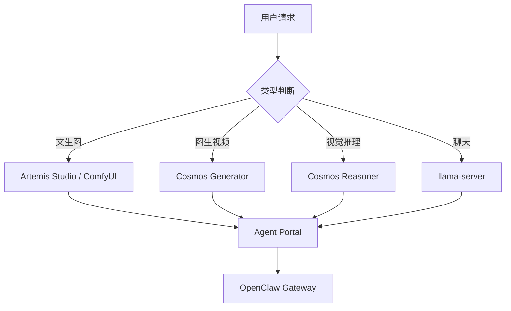

# Cosmos 集成分析

## 1. 硬件可行性

| 项目 | Cosmos 要求 | Artemis 现状 | 结论 |
|------|-------------|-------------|------|
| **GPU 架构** | NVIDIA Ampere / Hopper / Blackwell | RTX 5070 (Blackwell) | ✅ 兼容 |
| **最小模型** | Cosmos3-Nano (16B) | — | ⚠️ 严重问题 |
| **显存需求 (Nano)** | ~12GB+ (BF16 推理，无 vLLM) | 8GB (5.8GB llama 常驻) | ❌ 8GB 完全不够 |
| **显存需求 (Super)** | ~48GB+ (64B 四卡) | — | ❌ 不在考虑范围 |
| **操作系统** | Linux (硬性要求) | Windows 11 | ❌ 不支持 |
| **CUDA 版本** | 12.8 / 13.x | CUDA 12.4 (llama.cpp) | ⚠️ 需要 12.8+ |
| **PyTorch** | torch 2.x + cu128/cu130 | 现有 torch cu124 | ⚠️ 版本冲突 |

### 显存瓶颈详解

RTX 5070 只有 8GB 显存。当前 Artemis 的内存布局：
```
8 GB 总显存
├── llama-server 常驻：~5.8 GB
├── 空闲：~2.2 GB
│
├── TTS 推理：杀 llama → ~8 GB 空闲 (GPT-SoVITS ~2-3GB)
└── ComfyUI 画图：杀 llama → ~8 GB 空闲 (SDXL ~4-6GB)
```

Cosmos3-Nano (16B 参数) 纯推理至少需要 12GB+ 显存 (BF16)。即使在理想条件下（杀 llama，释放全部 8GB），仍然不够。**8GB 是物理上限，无法绕过。**

## 2. 操作系统限制（关键阻塞项）

Cosmos 所有官方集成（Diffusers / vLLM-Omni / vLLM / NIM）**明确声明仅支持 Linux**：
- `Operating system: Linux`
- 容器路径全部基于 Linux (Docker/`source .venv/bin/activate`/`apt-get`)
- 不支持 Windows 原生运行

### 理论上可能的路径
- **WSL2 + Docker**: 在 WSL2 中跑 vLLM-Omni 容器
- **但**: WSL2 GPU 直通会有额外 VRAM 开销，8GB 在 WSL2 下实际可用更少
- **结论**: 不是不能用，但显存问题让这一切没有意义

## 3. Cosmos 能为 Artemis 带来什么？

### 可能的价值点

| 能力 | 当前 Artemis 方案 | Cosmos 能提供的 | 实际收益 |
|------|-------------------|-----------------|---------|
| **文生图** | ComfyUI + SDXL/Illustrious (6.5GB) | Cosmos 文生图 (16B) | ⚠️ 质量可能更好但显存不够 |
| **图生视频** | ❌ 不支持 | Cosmos Image2Video | 🌟 全新能力！但需要显存 |
| **音视频生成** | TTS 独立 | Cosmos 同步音视频 | 🌟 但场景有限 |
| **动作预测** | ❌ 不支持 | Cosmos Action Policy/Forward Dynamics | 🌟 机器人控制场景 |
| **世界推理** | LLM 文本推理 | Cosmos Reasoner 视觉推理 | ⚠️ 与现有 LLM 功能重叠 |

### 最有吸引力的点
**图生视频** — 这是当前 Artemis 完全不具备的能力。用户可以用 ComfyUI 生成一张角色图，然后用 Cosmos 让图动起来。比如"夏目站在樱花树下微笑"变成一段视频。

**但**: 8GB 显存物理上不可能同时运行 llama + Cosmos 图生视频。

## 4. 实际可行路径（如果有 24GB+ GPU）

如果未来升级显卡（比如 RTX 5090 24GB+），Cosmos 集成的推荐架构：



### 集成模式：三模型共存

```
显存预算 (24GB 示例):
├── llama-server (聊天 LLM): ~6GB
├── Cosmos3-Nano (世界模型): ~12GB (可按需加载)
├── ComfyUI / TTS: 按需临时加载
└── 空闲: ~6GB (缓冲)
```

## 5. 当前可做的准备

即使在当前硬件上无法运行 Cosmos，可以在 Artemis 项目中预留集成接口：

### 5.1 在 Artemis Studio 中添加 Cosmos 占位选项卡

```python
# artemis_studio.py 中新增 CosmosTab
class CosmosTab(QWidget):
    """Cosmos 世界模型集成 (需要 Linux + 24GB+ GPU)"""
    def __init__(self):
        # 显示硬件检测结果 + 兼容性说明
        # 如果检测到兼容硬件 → 启用功能
        # 否则 → 显示升级建议
```

### 5.2 创建 Cosmos 调用脚本骨架

```
skills/cosmos/
├── cosmos_call.py          # Cosmos API 调用封装
├── run_image2video.ps1     # 图生视频脚本
├── run_reasoner.ps1        # 视觉推理脚本
└── SKILL.md                # 使用文档
```

### 5.3 在 AGENTS.md 中注册 Cosmos 能力

```
## 能力 5: Cosmos 世界模型 (需要 24GB+ GPU)
[能力描述和调用模板]
```

## 6. 总结

| 维度 | 结论 |
|------|------|
| **当前 (RTX 5070 8GB) 能否运行？** | ❌ 不可能。硬件硬伤。 |
| **WSL2 能绕过 OS 限制吗？** | 技术上可以，但 8GB 显存仍是物理上限 |
| **最小可行配置？** | RTX 5090 (24GB+) + Linux/WSL2 |
| **Cosmos 最大价值？** | 图生视频：让 AI 女友"动起来" |
| **现在该做什么？** | 1) 在 Artemis Studio 预留 Cosmos 入口<br>2) 创建兼容性检测<br>3) 写 Cosmos 调用脚本骨架<br>4) 等硬件升级后直接启用 |

### 优先级建议

1. **P0（现在就做）**: Artemis Studio 的 TTS + ComfyUI 独立通道 ✅ 已完成
2. **P1（本周）**: 在 Artemis Studio 添加 Cosmos 硬件检测 + 升级建议页面
3. **P2（硬件升级后）**: 实现 Cosmos 图生视频功能
4. **P3（远期）**: Cosmos Reasoner 替代/增强 LLM 视觉理解
